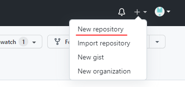
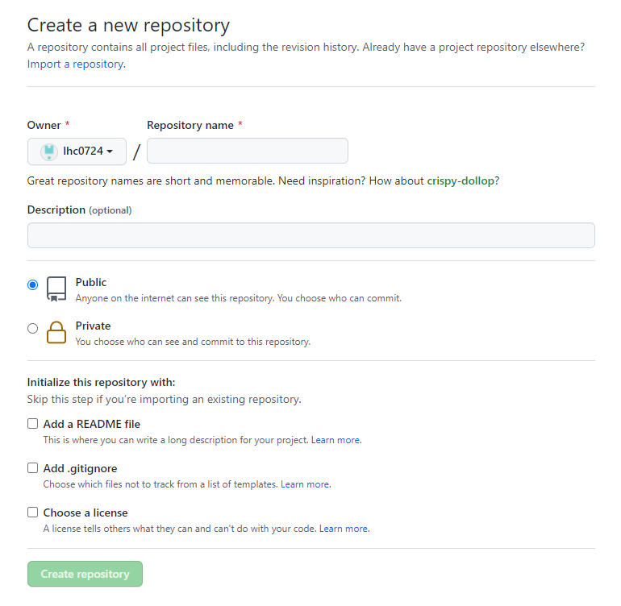

# GIT
> Git은 개인 및 팀, 협업 프로젝트 관리에 있어 가장 널리 쓰이는 툴이다.  
> 소스 코드의 버전관리 및 프로덕션과 디벨롭을 나누어 배포 할 때 유용하다.  

## GitHub Repository 생성하기
  

사진과 같이 사이트 우측상단 네비게이션바에 +버튼을 누르면 보이는 New repository를 눌러 새 저장소를 추가한다.  

  
repository name을 설정하고 비공개 저장소일 경우 Private 옵션을 선택한다.  
이후 Create repository 버튼을 누르면 저장소 생성 완료.

## Git Repository에 로컬프로젝트 Remote

### 1. Initialization
새롭게 만든 저장소에 프로젝트 관리를 시작 할 땐, 로컬 디렉토리에서 터미널을 열어 다음과 같이 입력한다.
```shell
git init
```  
그럼 Git 파일이 생성되고 해당 디렉토리 내에 모든 변경사항을 추적 및 관리하게 된다.

### 2. Committing code  
프로젝트의 현재 상태를 저장하는 것으로 커밋 히스토리를 통해 프로젝트의 코드 변경사항들을 확인 할 수 있다.  
커밋을 하기 전 staging area에 추가해야 commit을 통해 저장 할 수 있는데 이는  
git add 라는 명령어를 사용하여 추가한다.

```shell
git add [file or directory name] #특정 파일 혹은 디렉토리 추가
git add .  #현재 디렉토리 내에 있는 모든 파일 add
```

```shell
git commit -m "commit message" #커밋과 함께 남길 코맨트
```

### 3. Repository Push
아까 추가한 저장소에 연결하여 push를 진행하면,  
로컬에서 커밋한 내역이 깃 허브에 추가되어 공유 및 프로젝트의 관리가 시작된다.  

```shell
git remote add origin [repository address]
git remote -v
git push -u orign master
```