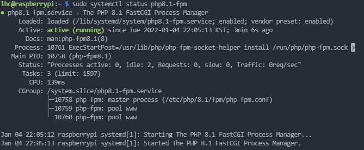
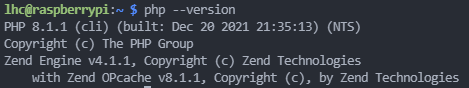
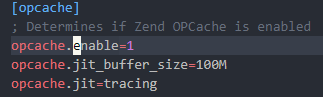

# 리눅스 환경에서 PHP 환경설정

> 서술할 환경은 다음과 같습니다.  
> Linux - Debian  
> Apache 2.x  
> MySQL  
> Laravel 8.x Framework  
> PHP 8.x  

## PHP8 소개 <a id="ch_1"></a>
기존 php5.x 혹은 php7.x에 비해 미래지향적인 기능들이 대거 도입되었으며,    
새로운 기능을 제외하고도 **JIT**의 도입으로 속도면에서도 최근 핫한 타 언어들과도 견줄 수 있게 되었다.  

- ### JIT?
    Just In Time의 약자로 런타임에 코드의 일부를 기계어로 컴파일하여 인터프리터임에도 미리  
    코드가 캐시되어 빠르게 불러와 동작하는 최적화 기술이다.

    코드의 실행 빈도에 따라, warm/hot으로 나누어 hot 파트를 기계어로 컴파일 되어 즉석하여 사용 할 수 있다.

## PHP8.x 설치하기
### 1. OS의 시스템과 패키지 업데이트
```shell
sudo apt update && sudo apt upgrade -y
``` 

### 2. PHP8 Sury 저장소 가져오기  
Ubuntu, CentOS, Fedora, Debian 등의 다른 저장소도 지원 하나, 여기서는 Sury Reository를 이용하였다.  
저장소를 추가 하기 전 **GPG Key**를 다운로드 한다.  

```shell
sudo wget -O /etc/apt/trusted.gpg.d/php.gpg https://packages.sury.org/php/apt.gpg
```

GPG키를 다운로드 후 Sury 저장소를 추가한다.

```shell
sudo sh -c 'echo "deb https://packages.sury.org/php/ $(lsb_release -sc) main" > /etc/apt/sources.list.d/php.list'
```

변경 사항을 반영하기 위해 update/upgrade 실행.

```shell
sudo apt update
sudo apt upgrade
``` 

### 3. Apache 모듈 설치
해당 환경에서는 Apache HTTP 서버를 이용합니다. 
**nginx(엔진엑스)** 와는 관련이 없는 내용입니다.  
php8.1 Apache 모듈을 다음 명령어로 설치합니다.

```shell
sudo apt install php8.1 libapache2-mod-php8.1
```

설치가 완료 되면 인스톨한 모듈이 로드 되도록 Apache 서버를 재실행 합니다.
```shell
sudo systemctl restart apache2
```
### 4. Apache용 PHP-FPM 모듈 설치
- PHP-FPM이란?

  >CGI의 일종으로 CGI(Common Gateway Interface)는 동적인 웹페이지를 구현하기 위해서,  
  >웹서버로 부터 요청을 받아 프로그램 파일을 읽어
  >html로 변환하는 외부 프로그램을 칭합니다.  
  >
  >PHP FastCGI Process Manager(PHP-FPM)는 일반 CGI보다 빠른 버전이라고 할 수 있습니다.  
  >Request를 받을 때 마다 Process를 생성하는 CGI와 달리 한번 생성된 Process를 재활용 하는  
  > 방법을 사용 합니다.

다음 명령을 통해 PHP-FPM과 Apache FPM 모듈을 설치합니다.
```shell
sudo apt install php8.1-fpm libapache2-mod-fcgid
```

기본적으로 Apache와 php-FPM은 서로 연동되어 있지 않아 다음 명령어를 통해 활성화를 합니다.
```shell
sudo a2enmod proxy_fcgi setenvif && sudo a2enconf php8.1-fpm
```

Apache를 다시 시작한 후 FPM이 동작 하는 지 확인합니다.
```shell
sudo systemctl restart apache2
sudo systemctl status php8.1-fpm
```

Active(running) 문구가 뜨면 FPM이 동작.  

* ETC   
    php의 버전을 확인하려면 다음 명령을 이용합니다.
    ```shell
    php --version
    ```

      

## JIT 컴파일러 활성화
앞에서 소개한 JIT 컴파일러는 PHP8에 처음으로 적용되어 기본적으로 비활성화 되어있습니다.
사용하기 위해서는 php.ini의 설정을 바꿔주어야 합니다.

php.ini의 수정을 위해 다음 명령어를 사용하여 vi 에디터를 통해 열어줍니다.
```shell
sudo vi /etc/php/8.1/fpm/php.ini
```
  
opcahce.enable 값이 주석처리 되어 있는것을 확인 할 수 있다.  

주석을 제거하여 다음과 같이 만들고 아래와 같은 옵션을 추가합니다.

