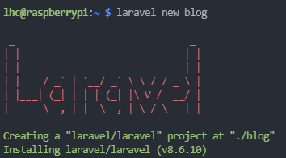

# PHP 라라벨 프레임워크 시작하기

## 라라벨 설치

해당 내용의 출처는 [라라벨 코리아][출처1]를 참고 하였습니다.

라라벨은 의존성 관리를 위해 컴포저를 사용한다.  
라라벨을 시작하기전에 PHP와 composer가 설치 되어 있다고 가정하고 서술.

먼저, 컴포저를 사용해 라라벨 인스톨러를 다운로드합니다.  

```shell
composer global require laravel/installer
```
라라벨 실행 파일을 시스템에서 찾을 수 있도록 컴포저의 시스템 vendor bin 디렉토리가 $PATH에 추가되었는지 확인하십시오.  
디렉토리는 운영체제별로 다른 위치에 있지만 보통 다음과 같습니다.

|OS|Route|
|---|---|
|macOS| $HOME/.composer/vendor/bin| 
|Windows|%USERPROFILE%\AppData\Roaming\Composer\vendor\bin|
|GNU, Linux Distributions| $HOME/.config/composer/vendor/bin or $HOME/.composer/vendor/bin |

```shell
composer global about
```
위와 같은 명령어를 실행하고 첫 번째 줄을 보면 컴포저의 글로벌 설치 경로를 확인할 수 있습니다.

라라벨 인스톨러를 설치한 후 laravel new [ directory name ] 명령을 입력하면 지정한 폴더 안에 깨끗한(fresh) 상태의 라라벨 파일을 생성할 것입니다.  

예를 들어 아래의 laravel new blog 명령은 라라벨에서 필요한 의존성 패키지들을 모두 설치하고
깨끗한(fresh) 상태의 라라벨 파일이 포함된 blog 디렉토리를 생성합니다.  
```shell
laravel new blog
```
결과 화면:  



[출처1]:https://laravel.kr/docs/8.x/installation
