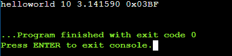

# Python3 Print Format
Python은 Print 출력에 있어 다양한 방법이 있어 따로 정리하였습니다.

## Old String Formatting (% Operator)
---
C언어의 printf 스타일의 포맷팅을 주로 사용했으면 익숙한 방식이다.    
하지만 데이터 타입을 정확히 알아야 하기 때문에 디버깅과정에서 번잡한 단점이 있다.  
또한 문자열이 길어질수록 코드의 가독성이 떨어짐.  

```python
text = 'helloworld'
integer = 10
pi = 3.14159
hexa = 0x03BF

print('%s %d %f 0x%.4X' % (text, integer, pi, hexa)) 
```

출력 결과  
  
  
  
주로 사용되는 타입 포맷팅:
|Conversion|Meaning|
|---|---|
|'d', 'i'|부호 있는 정수 타입|
|'o'|부호 있는 8진 타입|
|'u'|구식 표현법, 'd'로 대체됨|
|'x', 'X'|Hex값 표현식 'x' = lowercase/'X' = uppercase|
|'f', 'F'|부동소수점 포멧|
|'c'|싱글 캐릭터 타입|
|'s'|문자열 타입 (str()함수를 통해 해당 타입으로 변환 가능)|
|'r'|문자열 타입 (repr()함수를 통해 해당 타입으로 변환 가능)|
|'a'|문자열 타입 (ascii()함수를 통해 해당 타입으로 변환 가능)|

## String.format
---
Python에서 권장하는 문법으로 Python 3.6 이상에서는 f-String이라는 후속 포멧팅이 존재한다.  
```python
name = 'john'
age = 18

text = 'my name is {name}, I\'m {age} years old.'.format(name = name, age = age)
print(text)
# 'my name is john I'm 18 years old.'

print(('my name is {name}, I\'m {age} years old.').format(name = 'bob', age = 20))
# 'my name is bob I'm 20 years old.'

print(('hello {0}, {1}').format('bob',name))
# 'hello bob, john
```
이와 같이 string.format 에서는 다양한 표현 방식으로 지원이 된다.

## f-String
---
Python 3.6이상에서 지원하는 문법이다.  
String.format 방식의 문법은 코드가 장황해지는 경우가 많은데, 이를 해결하기 위해 고안됌.  
또한 더욱 강력해져 간단한 산술 연산까지 지원한다.

```python
a = 10
b = 20
name = 'bob'

text = f'{a} + {b} = {a+b}'
print(text)
# '10 + 20 = 30'

print(f'hello {name}')
# 'hello bob'
```