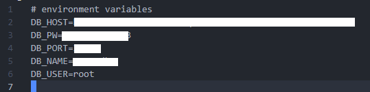
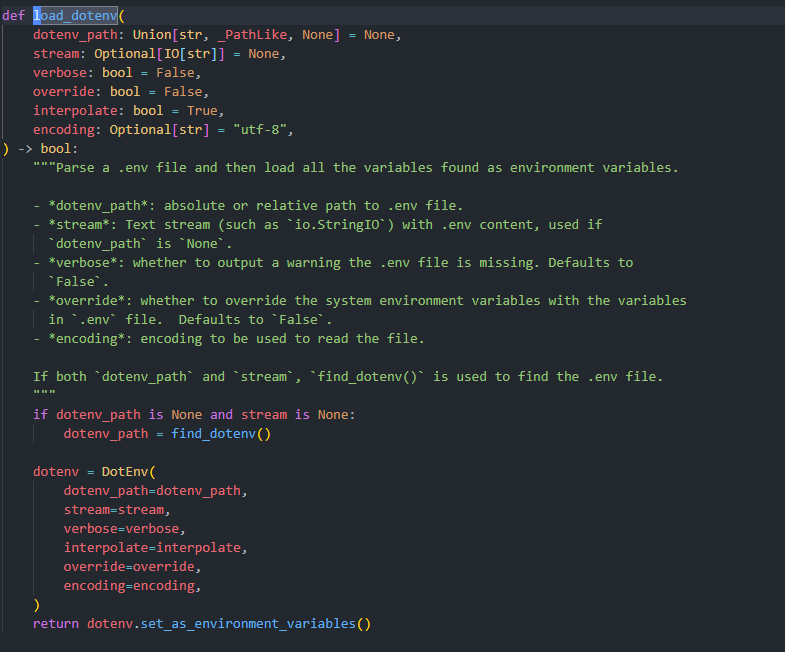

# Python Dotenv 적용시키기

## dotenv?
프로그램 별로 환경변수를 참조 할 수 있도록 .env 파일 형태로 저장해둔 것을 의미한다.  
> 환경변수란 os에서 프로세스를 실행 시키기 위해 참조하는 변수를 뜻함.

여러 개발 환경에서 .env 모듈 혹은 라이브러리로 지원하며,  
python에서는 어떻게 사용하는지 정리하였다.


## python-dotenv module install
> 패키지 배포 페이지  
> https://pypi.org/project/python-dotenv/ 
```shell
pip install python-dotenv
```
이후 .env 파일을 작성한다.  
이때, 경로는 보통 프로젝트 단위로 관리하기 위해 Project root에 저장한다.

### .env 파일 작성요령
<!--    -->

<p align = 'left'>  
    <span> DB config을 설정한 .env 파일 </span>
    <br/>
    
</p>

변수 값은 전부 문자열로 저장되며, 타입의 상관없이 따옴표는 생략한다.  
변수명은 보통 대문자로 작성한다.

## .env 불러오기
작성한 db confg env 파일을 불러와 pymysql로 간단히 커넥트 해보는 예제를 작성해보았다.
``` python
    import pymysql
    import os
    from dotenv import load_dotenv


    class db_conf:
        def __init__(self) -> None: 
            load_dotenv()
            self.conn = pymysql.connect (
                user=os.environ.get('DB_USER'),
                db=os.environ.get('DB_NAME'),
                port=os.environ.get('DB_PORT'),
                passwd=os.environ.get('DB_PW'),
                host=os.environ.get('DB_HOST'),
                charset='utf8'
            )

        def get_connect(self):
            return conn;

if __name__ == '__main__'
    conf = db_conf()

    connect = conf.get_connect()
    sql = 'select * from user'

    connect.execute(sql)
    rows = connect.fetchall()

    print(rows)
```

### load_dotenv() 분석
모듈을 타고 들어가면 다음과 같이 정의되어 있는것을 볼 수 있다.
  

* dotenv_path: .env 파일의 경로를 받으며 없을경우 자동으로 find_dotenv 함수를 통해 경로를 찾아낸다.   
* stream: .env 파일 내용에 대한 StringIO 객체
* verbose: .env 파일에 관한 경고 메세지를 등에 대한 출력 옵션 변수
* override: 시스템 환경변수를 .env 파일에 정의한 변수로 덮어 쓰는지에 대한 옵션 변수
* interpolate: posix 변수 확장을 이용하여 변수 보간을 할 수 있는데 이에 관한 옵션 변수
* encoding: 문자 인코딩 변수 default(utf-8)